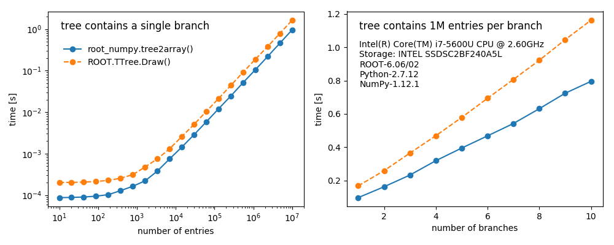

.. -*- mode: rst -*-

`[see the full documentation] <http://rootpy.github.com/root_numpy/>`_

root_numpy: The interface between ROOT and NumPy
================================================

.. image:: https://img.shields.io/pypi/v/root_numpy.svg
   :target: https://pypi.python.org/pypi/root_numpy
.. image:: https://travis-ci.org/rootpy/root_numpy.png
   :target: https://travis-ci.org/rootpy/root_numpy
.. image:: https://coveralls.io/repos/rootpy/root_numpy/badge.svg?branch=master
   :target: https://coveralls.io/r/rootpy/root_numpy?branch=master
.. image:: https://landscape.io/github/rootpy/root_numpy/master/landscape.svg?style=flat
   :target: https://landscape.io/github/rootpy/root_numpy/master
.. image:: https://zenodo.org/badge/14091/rootpy/root_numpy.svg
   :target: https://zenodo.org/badge/latestdoi/14091/rootpy/root_numpy

root_numpy is a Python extension module that provides an efficient interface
between `ROOT <http://root.cern.ch/>`_ and `NumPy <http://www.numpy.org/>`_.
root_numpy's internals are compiled C++ and can therefore handle large amounts
of data much faster than equivalent pure Python implementations.

With your ROOT data in NumPy form, make use of NumPy's `broad library
<http://docs.scipy.org/doc/numpy/reference/>`_, including fancy indexing,
slicing, broadcasting, random sampling, sorting, shape transformations, linear
algebra operations, and more. See this `tutorial
<https://docs.scipy.org/doc/numpy-dev/user/quickstart.html>`_ to get started.
NumPy is the fundamental library of the scientific Python ecosystem. Using
NumPy arrays opens up many new possibilities beyond what ROOT offers. Convert
your TTrees into NumPy arrays and use `SciPy <http://www.scipy.org/>`_ for
numerical integration and optimization, `matplotlib <http://matplotlib.org/>`_
for plotting, `pandas <http://pandas.pydata.org/>`_ for data analysis,
`statsmodels <http://statsmodels.sourceforge.net/>`_ for statistical modelling,
`scikit-learn <http://scikit-learn.org/>`_ for machine learning, and perform
quick exploratory analysis in a `Jupyter notebook <https://jupyter.org/>`_.

At the core of root_numpy are powerful and flexible functions for converting
`ROOT TTrees <https://root.cern.ch/doc/master/classTTree.html>`_ into
`structured NumPy arrays
<http://docs.scipy.org/doc/numpy/user/basics.rec.html>`_ as well as converting
NumPy arrays back into ROOT TTrees. root_numpy can convert branches of strings
and basic types such as bool, int, float, double, etc. as well as
variable-length and fixed-length multidimensional arrays and 1D or 2D vectors
of basic types and strings. root_numpy can also create columns in the output
array that are expressions involving the TTree branches similar to
``TTree::Draw()``.

Did we mention that root_numpy is fast?

